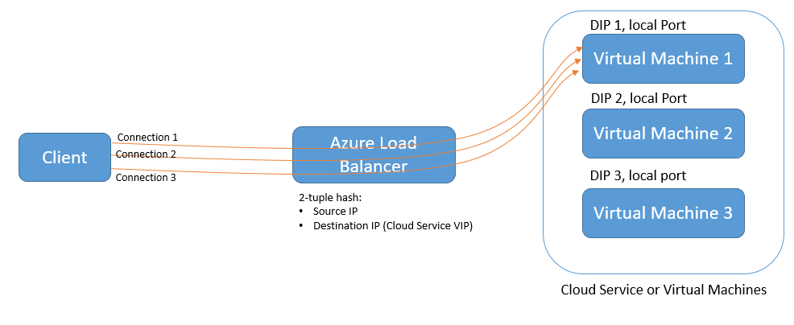

<properties 
   pageTitle="配置负载平衡器分发模式 | Azure"
   description="如何配置 Azure Load Balancer 分发模式以支持源 IP 关联"
   services="load-balancer"
   documentationCenter="na"
   authors="joaoma"
   manager="carmonm"
   editor="tysonn" />
<tags 
   ms.service="load-balancer"
   ms.date="04/05/2016"
   wacn.date="08/29/2016" />

# 负载平衡器的分发模式（源 IP 关联）

我们推出了名为“源 IP 关联”（也称为会话关联或客户端 IP 关联）的新分发模式。可将 Azure Load Balancer 配置为使用 2 个元组（源 IP、目标 IP）或 3 个元组（源 IP、目标 IP、协议），以将流量映射到可用的服务器。通过使用源 IP 关联，从同一客户端计算机发起的连接将进入同一个 DIP 终结点。

源 IP 关联解决了 Azure Load Balancer 与 RD 网关之间的不兼容性。现在，你可以在单个云服务中构建 RD 网关场。
另一种使用方案是媒体上载。媒体上载通过 UDP 进行实际数据上载，但可通过 TCP 实现控制面：

- 客户端首先与负载平衡的公共地址发起 TCP 会话，然后定向到特定 DIP，此通道将保持活动状态以监视连接运行状况
- 来自同一客户端计算机的新 UDP 会话在同一个负载平衡公共终结点中发起，我们希望此连接像以前的 TCP 连接一样被定向到同一个 DIP 终结点，以便能够以高吞吐量执行媒体上载，同时通过 TCP 维护控制通道。
 
请注意，如果负载平衡集发生更改（删除或添加虚拟机），则会重新计算客户端请求的分发。你无法确保现有客户端会话的新连接最终都会抵达同一台服务器。此外，使用源 IP 关联分发模式可能导致流量的不均衡分发。在代理后面运行的客户端可被视为唯一的客户端应用程序。

使用的分发算法是将流量映射到可用服务器的 5 元组（源 IP、源端口、目标 IP、目标端口和协议类型）哈希。它仅在传输会话内部提供粘性。同一 TCP 或 UDP 会话中的数据包将会定向到经过负载平衡的终结点后面的同一数据中心 IP (DIP) 实例。当客户端关闭连接后再重新将其打开，或者从同一源 IP 发起新会话时，源端口将会变化，并且会导致流量定向到不同的 DIP 终结点。

## 配置负载平衡器的源 IP 关联设置
 
对于虚拟机，可以使用 powershell 来更改超时设置：
 
将 Azure 终结点添加到虚拟机并设置负载平衡器分发模式

	Get-AzureVM -ServiceName mySvc -Name MyVM1 | Add-AzureEndpoint -Name HttpIn -Protocol TCP -PublicPort 80 -LocalPort 8080 –LoadBalancerDistribution sourceIP | Update-AzureVM

>[AZURE.NOTE] LoadBalancerDistribution 可以设置为 sourceIP（用于 2 元组（源 IP、目标 IP）负载平衡）、sourceIPProtocol（用于 3 元组（源 IP、目标 IP、协议）负载平衡）或 none（如果想要使用 5 元组负载平衡的默认行为）。

检索终结点负载平衡器分发模式配置

	PS C:\> Get-AzureVM –ServiceName MyService –Name MyVM | Get-AzureEndpoint

	VERBOSE: 6:43:50 PM - Completed Operation: Get Deployment
	LBSetName : MyLoadBalancedSet
	LocalPort : 80
	Name : HTTP
	Port : 80
	Protocol : tcp
	Vip : 65.52.xxx.xxx
	ProbePath :
	ProbePort : 80
	ProbeProtocol : tcp
	ProbeIntervalInSeconds : 15
	ProbeTimeoutInSeconds : 31
	EnableDirectServerReturn : False
	Acl : {}
	InternalLoadBalancerName :
	IdleTimeoutInMinutes : 15
	LoadBalancerDistribution : sourceIP
 
如果 LoadBalancerDistribution 元素不存在，则 Azure Load balancer 使用默认的 5 元组算法。

 
### 在负载平衡终结点集上设置分发模式

如果终结点是负载平衡终结点集的一部分，则必须在负载平衡终结点集上设置分发模式：

	Set-AzureLoadBalancedEndpoint -ServiceName MyService -LBSetName LBSet1 -Protocol TCP -LocalPort 80 -ProbeProtocol TCP -ProbePort 8080 –LoadBalancerDistribution sourceIP

### 用于更改分发模式的云服务配置

可以利用用于 .NET 的 Azure SDK 2.5（将在 11 月发布）来更新你在 .csdef 中为云服务指定的云服务终结点设置。
若要更新云服务部署的负载平衡器分发模式，需要进行部署升级。
下面是终结点设置的 .csdef 更改的示例：

	<WorkerRole name="worker-role-name" vmsize="worker-role-size" enableNativeCodeExecution="[true|false]">
  	<Endpoints>
    <InputEndpoint name="input-endpoint-name" protocol="[http|https|tcp|udp]" localPort="local-port-number" port="port-number" certificate="certificate-name" loadBalancerProbe="load-balancer-probe-name" loadBalancerDistribution="sourceIP" />
  	</Endpoints>
	</WorkerRole>
	<NetworkConfiguration>
  	<VirtualNetworkSite name="VNet"/>
  	<AddressAssignments>
    <InstanceAddress roleName="VMRolePersisted">
      <PublicIPs>
        <PublicIP name="public-ip-name" idleTimeoutInMinutes="timeout-in-minutes"/>
      </PublicIPs>
    </InstanceAddress>
  	</AddressAssignments>
	</NetworkConfiguration>

## API 示例

可以使用服务管理 API 来配置负载平衡器分发。
请确保 `x-ms-version` 标头已设置为 `2014-09-01` 或更高版本。
 
更新部署中指定的负载平衡集配置

请求示例

	POST https://management.core.chinacloudapi.cn/<subscription-id>/services/hostedservices/<cloudservice-name>/deployments/<deployment-name>?comp=UpdateLbSet 

	x-ms-version: 2014-09-01 

	Content-Type: application/xml 

	<LoadBalancedEndpointList xmlns="http://schemas.microsoft.com/windowsazure" xmlns:i="http://www.w3.org/2001/XMLSchema-instance"> 
	<InputEndpoint> 
	<LoadBalancedEndpointSetName> endpoint-set-name </LoadBalancedEndpointSetName> 
	<LocalPort> local-port-number </LocalPort> 
	<Port> external-port-number </Port> 
	<LoadBalancerProbe> 
	<Port> port-assigned-to-probe </Port> 
	<Protocol> probe-protocol </Protocol> 
	<IntervalInSeconds> interval-of-probe </IntervalInSeconds> 
	<TimeoutInSeconds> timeout-for-probe </TimeoutInSeconds> 
	</LoadBalancerProbe> 
	<Protocol> endpoint-protocol </Protocol> 
	<EnableDirectServerReturn> enable-direct-server-return </EnableDirectServerReturn> 
	<IdleTimeoutInMinutes>idle-time-out</IdleTimeoutInMinutes> 
	<LoadBalancerDistribution>sourceIP</LoadBalancerDistribution> 
	</InputEndpoint> 
	</LoadBalancedEndpointList>

LoadBalancerDistribution 的值可以是 sourceIP（用于 2 元组关联）、sourceIPProtocol（用于 3 元组关联）或 none（用于无关联，即 5 元组）

	Response

	HTTP/1.1 202 Accepted 
	Cache-Control: no-cache 
	Content-Length: 0 
	Server: 1.0.6198.146 (rd_rdfe_stable.141015-1306) Microsoft-HTTPAPI/2.0 
	x-ms-servedbyregion: ussouth2 
	x-ms-request-id: 9c7bda3e67c621a6b57096323069f7af 
	Date: Thu, 16 Oct 2014 22:49:21 GMT

## 后续步骤

[Internal load balancer overview](/documentation/articles/load-balancer-internal-overview/)（内部负载平衡器概述）

[Get started Configuring an Internet facing load balancer](/documentation/articles/load-balancer-get-started-internet-arm-ps/)（开始配置面向 Internet 的负载平衡器）

[Configure idle TCP timeout settings for your load balancer](/documentation/articles/load-balancer-tcp-idle-timeout/)（为负载平衡器配置空闲 TCP 超时设置）

<!---HONumber=Mooncake_0822_2016-->